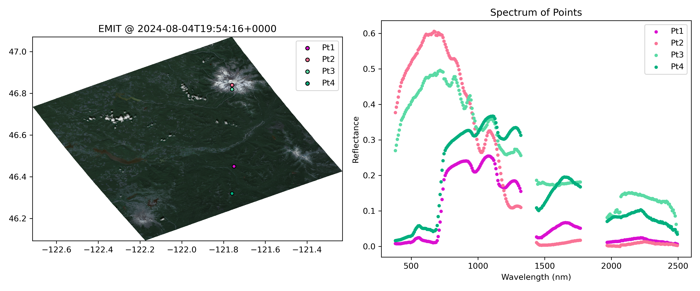

## EMIT-Search

This method is built from some emit-tools functions (see [repo](https://github.com/nasa/EMIT-Data-Resources)), but also has some added features to help for data exploration. Main advantage is the quickview functionality that pulls up images based on latitude and longitude. Data can be explored and saved. Likely AppEARS is faster at grabbing subsets, but this may still be useful for troubleshooting / data exploration.

To run, 
- download zip of this code using green button above
- use miniconda to install env, `conda env create -f env.yml`
- have/create NASA earthaccess login
- run `emit_search.ipynb`

